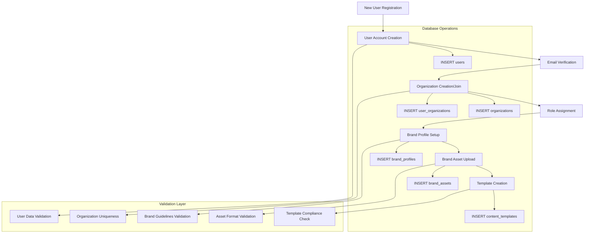
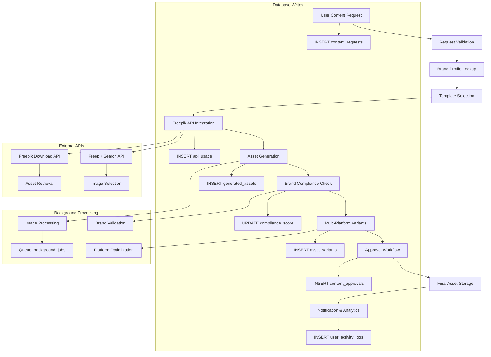
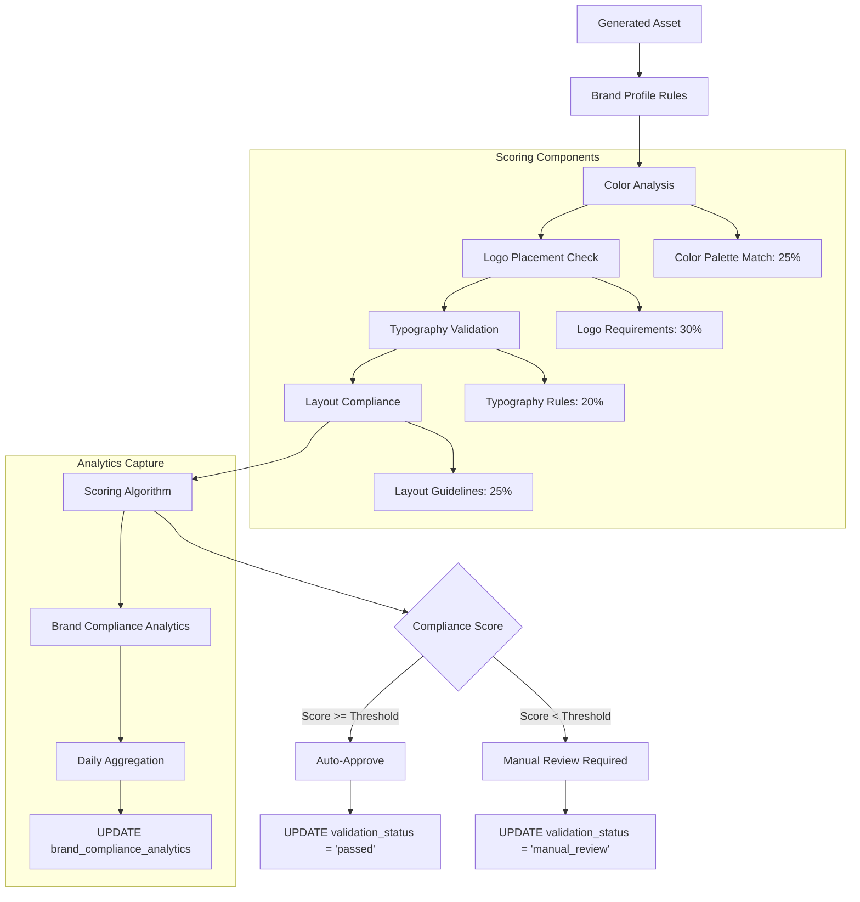
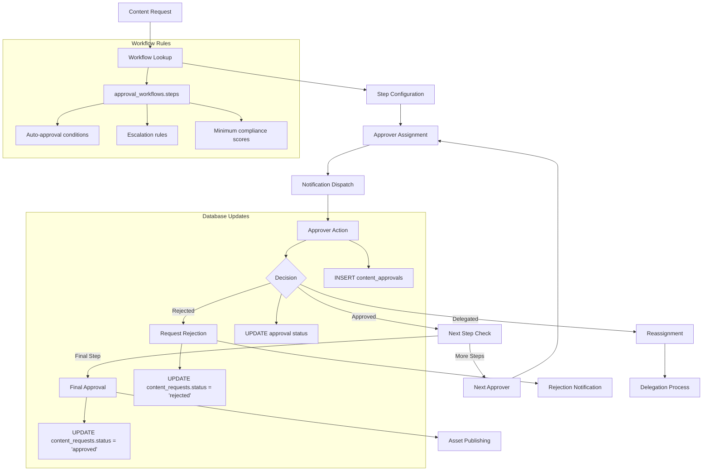
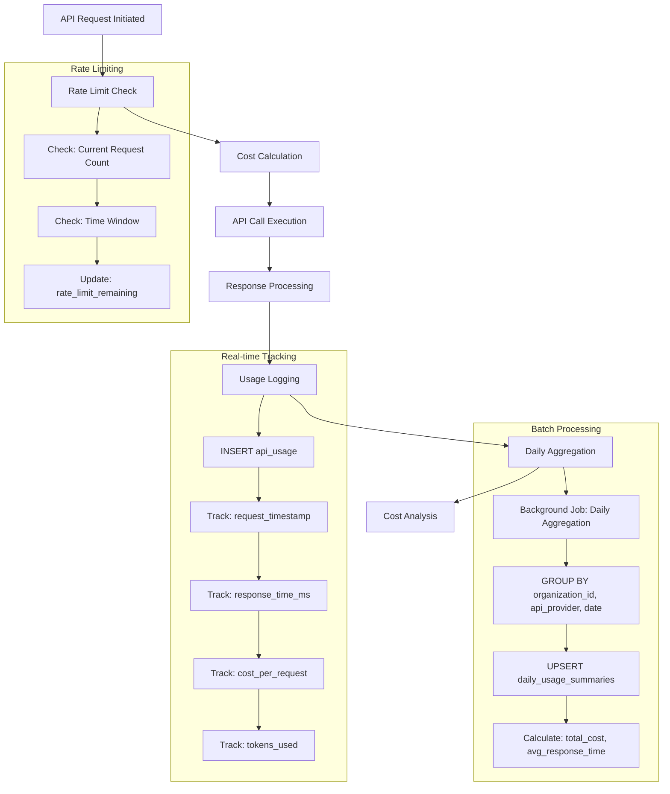
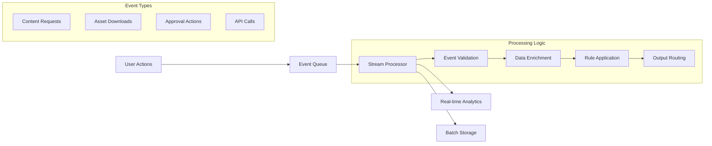

# Data Flow Documentation
## Social Media Content Visual Pipeline

### Overview

This document outlines the complete data flow patterns within the Social Media Content Visual Pipeline, detailing how data moves through the system from initial user requests to final analytics collection.

### Core Data Flow Patterns

#### 1. User Onboarding and Organization Setup



#### 2. Content Generation Request Flow



#### 3. Brand Compliance Validation Flow



#### 4. Approval Workflow Data Flow



#### 5. API Usage and Cost Tracking Flow



#### 6. Analytics Data Collection Flow

```mermaid
flowchart TD
    A[Published Content] --> B[Platform Integration]
    B --> C[Performance Data Fetch]
    C --> D[Data Normalization]
    D --> E[Metrics Calculation]
    E --> F[Analytics Storage]
    F --> G[Reporting Aggregation]
    
    subgraph "Performance Metrics"
        C --> C1[Impressions Data]
        C --> C2[Engagement Data]
        C --> C3[Click Data]
        C --> C4[Conversion Data]
    end
    
    subgraph "Calculated Analytics"
        E --> E1[Engagement Rate = (likes + shares + comments) / impressions]
        E --> E2[Click-through Rate = clicks / impressions]
        E --> E3[Conversion Rate = conversions / clicks]
    end
    
    subgraph "Database Operations"
        F --> F1[INSERT content_analytics]
        F1 --> F2[Platform-specific metrics]
        F2 --> F3[Time-series data points]
        G --> G1[Brand performance summaries]
        G1 --> G2[Template effectiveness metrics]
    end
    
    subgraph "External Integrations"
        B --> B1[Instagram API]
        B --> B2[Facebook API]
        B --> B3[LinkedIn API]
        B --> B4[Twitter API]
    end
```

### Data Processing Patterns

#### Batch Processing Jobs

1. **Daily Usage Aggregation**
   ```sql
   -- Executed nightly via background_jobs
   INSERT INTO daily_usage_summaries (
       organization_id, usage_date, api_provider,
       total_requests, successful_requests, total_cost
   )
   SELECT 
       organization_id,
       DATE(request_timestamp),
       api_provider,
       COUNT(*),
       COUNT(CASE WHEN response_status BETWEEN 200 AND 299 THEN 1 END),
       SUM(cost_per_request)
   FROM api_usage
   WHERE DATE(request_timestamp) = CURRENT_DATE - INTERVAL '1 day'
   GROUP BY organization_id, DATE(request_timestamp), api_provider;
   ```

2. **Brand Compliance Analytics**
   ```sql
   -- Weekly brand compliance summary
   INSERT INTO brand_compliance_analytics (
       brand_profile_id, analysis_date,
       total_assets_generated, average_compliance_score
   )
   SELECT 
       brand_profile_id,
       CURRENT_DATE,
       COUNT(*),
       AVG(compliance_score)
   FROM generated_assets
   WHERE DATE(created_at) >= CURRENT_DATE - INTERVAL '7 days'
   GROUP BY brand_profile_id;
   ```

#### Real-time Processing

1. **Content Request Processing**
   - Immediate validation of request parameters
   - Real-time brand profile lookup and rule application
   - Asynchronous Freepik API integration
   - Live compliance scoring

2. **User Activity Tracking**
   - Session-based activity logging
   - Real-time audit trail generation
   - Immediate security event detection

#### Stream Processing Considerations



### Data Consistency Patterns

#### Transaction Management

1. **Content Generation Transaction**
   ```sql
   BEGIN;
   
   -- Create content request
   INSERT INTO content_requests (...) VALUES (...);
   
   -- Log API usage
   INSERT INTO api_usage (...) VALUES (...);
   
   -- Create generated assets
   INSERT INTO generated_assets (...) VALUES (...);
   
   -- Create platform variants
   INSERT INTO asset_variants (...) VALUES (...);
   
   -- Update usage statistics
   UPDATE brand_profiles SET usage_count = usage_count + 1 WHERE ...;
   
   COMMIT;
   ```

2. **Approval Workflow Transaction**
   ```sql
   BEGIN;
   
   -- Record approval decision
   INSERT INTO content_approvals (...) VALUES (...);
   
   -- Update content request status
   UPDATE content_requests SET status = 'approved' WHERE ...;
   
   -- Log user activity
   INSERT INTO user_activity_logs (...) VALUES (...);
   
   COMMIT;
   ```

#### Data Validation Rules

1. **Referential Integrity Checks**
   - All foreign keys validated before insertion
   - Cascade deletion rules prevent orphaned records
   - Cross-table consistency maintained through triggers

2. **Business Logic Validation**
   - Brand compliance scores within valid range (0.00-1.00)
   - API usage costs properly calculated and tracked
   - User permissions verified before data access

### Performance Optimization Strategies

#### Query Optimization

1. **Indexed Query Patterns**
   ```sql
   -- Optimized for organization-scoped queries
   SELECT * FROM content_requests 
   WHERE organization_id = ? AND status = 'pending'
   ORDER BY priority DESC, created_at ASC;
   
   -- Uses: idx_content_requests_org + idx_content_requests_status
   ```

2. **Aggregation Queries**
   ```sql
   -- Pre-computed via materialized views
   SELECT organization_name, total_cost, total_requests
   FROM v_daily_api_usage
   WHERE usage_date >= CURRENT_DATE - INTERVAL '30 days';
   ```

#### Caching Strategy

1. **Application-Level Caching**
   - Brand profiles cached for 1 hour
   - Content templates cached for 30 minutes
   - System settings cached for 24 hours

2. **Database-Level Caching**
   - Query result caching for analytics
   - Prepared statement caching
   - Connection pooling optimization

This comprehensive data flow documentation ensures efficient data processing, maintains consistency, and provides clear patterns for system monitoring and optimization.