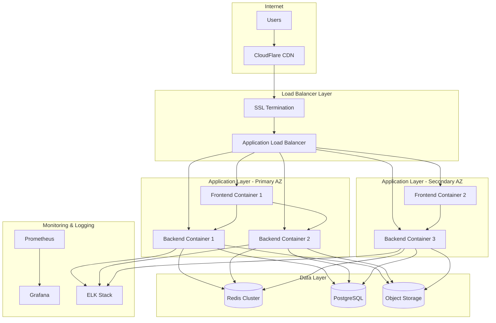

# Production Deployment Architecture
## Social Media Content Visual Pipeline - BYMB Consultancy

### Executive Summary

This document outlines a comprehensive production deployment strategy for the Social Media Content Visual Pipeline, built on the existing MVP template infrastructure. The architecture prioritizes scalability, reliability, and cost-effectiveness for BYMB Consultancy's content generation needs.

### Current Infrastructure Analysis

**Existing Components:**
- Docker containerization with multi-stage builds
- FastAPI backend with Python 3.12
- Next.js 14 frontend with TypeScript
- Comprehensive service layer (Freepik integration, brand validation, caching)
- Redis for caching and rate limiting
- Environment-based configuration management
- Testing framework foundation with pytest and coverage

**Strengths:**
- Well-structured microservices architecture
- Production-ready Docker configurations
- Comprehensive configuration management
- Existing rate limiting and cost tracking
- Brand validation and compliance systems

## Production Deployment Architecture

### 1. Infrastructure Overview



### 2. Cloud Platform Recommendations

**Primary Option: AWS**
- **Compute**: ECS Fargate for container orchestration
- **Database**: RDS PostgreSQL with Multi-AZ deployment
- **Caching**: ElastiCache Redis cluster
- **Storage**: S3 for generated assets with CloudFront CDN
- **Load Balancing**: Application Load Balancer
- **Monitoring**: CloudWatch + Prometheus/Grafana

**Cost-Effective Alternative: DigitalOcean**
- **Compute**: Kubernetes clusters or App Platform
- **Database**: Managed PostgreSQL cluster
- **Caching**: Managed Redis cluster
- **Storage**: Spaces (S3-compatible) with CDN
- **Load Balancing**: Load Balancers
- **Monitoring**: Built-in monitoring + Grafana

**Budget Option: Railway/Render**
- **Compute**: Container deployments
- **Database**: Managed PostgreSQL
- **Caching**: Upstash Redis
- **Storage**: Cloudinary or AWS S3
- **CDN**: CloudFlare
- **Monitoring**: Built-in metrics

### 3. Container Orchestration Strategy

**Production Container Architecture:**

```yaml
# High-level service configuration
Services:
  - Frontend (2+ instances)
    - Next.js production build
    - Static asset serving
    - Auto-scaling: 2-10 instances
    
  - Backend API (3+ instances)
    - FastAPI with uvicorn
    - Freepik integration services
    - Auto-scaling: 3-15 instances
    
  - Redis Cache Cluster
    - Session storage
    - API response caching
    - Rate limiting data
    
  - PostgreSQL Database
    - User data and analytics
    - Brand templates and assets
    - Generation history
    
  - Background Workers (optional)
    - Async content generation
    - Batch processing
    - Scheduled brand validation
```

### 4. Database Strategy

**Primary Database: PostgreSQL**
```sql
-- Core tables structure
Tables:
  - users (authentication, profiles)
  - brand_profiles (company branding data)
  - content_generations (generation history)
  - brand_assets (logos, templates, guidelines)
  - usage_analytics (API usage, costs)
  - rate_limits (user quotas, API limits)
```

**Caching Strategy: Redis**
```yaml
Cache Layers:
  - API Response Cache (TTL: 1 hour)
  - Brand Asset Cache (TTL: 24 hours)
  - User Session Cache (TTL: 7 days)
  - Rate Limiting Cache (TTL: sliding window)
  - Freepik Search Results (TTL: 4 hours)
```

### 5. CDN and Asset Management

**Static Assets Strategy:**
- Brand logos and templates: S3/Spaces with CloudFront/CDN
- Generated content: Temporary S3 storage (7-day retention)
- Frontend assets: CDN with aggressive caching
- API responses: CloudFlare caching for GET endpoints

**Asset Processing Pipeline:**
1. User uploads brand assets → S3 storage
2. Automatic optimization and resizing
3. CDN distribution for fast global access
4. Generated content temporary storage
5. Cleanup automation for cost optimization

### 6. Security Architecture

**Network Security:**
- WAF (Web Application Firewall) protection
- DDoS protection via CloudFlare
- VPC with private subnets for databases
- Security groups restricting inter-service communication

**Application Security:**
- JWT authentication with short expiration
- API rate limiting per user/IP
- Input validation and sanitization
- HTTPS everywhere with SSL/TLS 1.3
- Secrets management via environment variables

**Data Security:**
- Database encryption at rest and in transit
- S3 bucket encryption and access policies
- Redis AUTH and SSL connections
- Regular security audits and dependency updates

### 7. Monitoring and Observability

**Application Monitoring:**
```yaml
Metrics Collection:
  - Custom business metrics (generations/day, brand compliance)
  - Infrastructure metrics (CPU, memory, network)
  - API performance metrics (response time, error rates)
  - Cost tracking metrics (Freepik API usage, cloud costs)

Alerting Rules:
  - High error rates (>5% for 5 minutes)
  - High response times (>2s average for 5 minutes)
  - Low brand compliance scores (<80% for 10 minutes)
  - Budget threshold alerts (80% of daily/monthly limits)
  - Infrastructure resource alerts (>90% CPU/memory)
```

**Logging Strategy:**
```yaml
Log Levels:
  - ERROR: System failures, API errors
  - WARN: Rate limit exceeded, low brand scores
  - INFO: User actions, successful generations
  - DEBUG: Detailed API interactions (non-production)

Log Aggregation:
  - Centralized logging via ELK stack or Cloud Logging
  - Structured JSON logging for better parsing
  - Log retention: 30 days for production
  - Real-time log monitoring and alerting
```

### 8. Backup and Disaster Recovery

**Backup Strategy:**
- Database: Automated daily backups with 30-day retention
- Brand assets: Cross-region S3 replication
- Configuration: Version-controlled infrastructure as code
- Application data: Point-in-time recovery capability

**Disaster Recovery:**
- RTO (Recovery Time Objective): 4 hours
- RPO (Recovery Point Objective): 1 hour
- Multi-AZ database deployment
- Automated failover capabilities
- Regular disaster recovery testing

### 9. Performance Optimization

**Scaling Strategies:**
```yaml
Horizontal Scaling:
  - Auto-scaling based on CPU/memory metrics
  - Load balancer with health checks
  - Session-less architecture for easy scaling

Vertical Scaling:
  - Right-sized instances based on usage patterns
  - Regular performance monitoring and optimization

Caching Optimization:
  - Multi-layer caching strategy
  - Cache warming for frequently accessed data
  - Intelligent cache invalidation
```

**Performance Targets:**
- API response time: <500ms for 95% of requests
- Frontend load time: <2s for 95% of users
- Image generation time: <30s for 90% of requests
- 99.9% uptime availability

### 10. Cost Optimization

**Resource Optimization:**
- Spot instances for non-critical workloads
- Reserved instances for predictable workloads
- Automatic scaling down during low usage
- Regular cost analysis and optimization

**API Cost Management:**
- Intelligent caching to reduce Freepik API calls
- User quotas and budget alerts
- Cost tracking per customer/project
- Automated cost reporting and optimization suggestions

### 11. Deployment Zones and Regions

**Primary Deployment: US East (for Freepik API proximity)**
- Primary region: us-east-1 (AWS) or nyc1 (DigitalOcean)
- Secondary region: us-west-2 for disaster recovery
- Edge locations: Global CDN for frontend assets

**International Expansion:**
- EU region: eu-central-1 for GDPR compliance
- APAC region: ap-southeast-1 for Asian markets
- Data residency compliance for international customers

This architecture provides a solid foundation for deploying the Social Media Content Visual Pipeline with enterprise-grade reliability, security, and scalability while maintaining cost-effectiveness for BYMB Consultancy's growth trajectory.