# Entity Relationship Diagram
## Social Media Content Visual Pipeline Database Schema

### Core Entity Relationships

```mermaid
erDiagram
    %% Core User Management
    USERS {
        uuid id PK
        varchar email UK
        varchar username UK
        varchar password_hash
        varchar first_name
        varchar last_name
        varchar role
        boolean is_active
        timestamp created_at
        jsonb metadata
    }
    
    ORGANIZATIONS {
        uuid id PK
        varchar name
        varchar slug UK
        text description
        varchar industry
        varchar website_url
        varchar logo_url
        uuid created_by FK
        timestamp created_at
        jsonb settings
    }
    
    USER_ORGANIZATIONS {
        uuid id PK
        uuid user_id FK
        uuid organization_id FK
        varchar role
        boolean is_active
        timestamp joined_at
    }
    
    %% Brand Management
    BRAND_PROFILES {
        uuid id PK
        uuid organization_id FK
        varchar name
        varchar primary_color
        varchar secondary_color
        varchar accent_color
        jsonb color_palette
        varchar primary_font
        varchar secondary_font
        varchar logo_primary_url
        text brand_voice_tone
        varchar enforcement_level
        decimal minimum_compliance_score
        uuid created_by FK
        timestamp created_at
    }
    
    BRAND_ASSETS {
        uuid id PK
        uuid brand_profile_id FK
        varchar name
        varchar asset_type
        varchar file_path
        varchar file_url
        integer file_size_bytes
        jsonb dimensions
        text_array usage_context
        jsonb platform_variants
        integer usage_count
        uuid created_by FK
        timestamp created_at
        text_array tags
    }
    
    CONTENT_TEMPLATES {
        uuid id PK
        uuid brand_profile_id FK
        varchar name
        varchar template_type
        varchar platform
        jsonb format_specifications
        jsonb layout_config
        jsonb text_zones
        jsonb image_zones
        jsonb brand_elements
        integer usage_count
        decimal average_engagement_score
        uuid created_by FK
        timestamp created_at
    }
    
    %% Content Generation
    CONTENT_REQUESTS {
        uuid id PK
        uuid organization_id FK
        uuid brand_profile_id FK
        uuid requested_by FK
        varchar title
        text description
        text content_brief
        text_array target_platforms
        varchar content_type
        uuid template_id FK
        jsonb style_preferences
        text_array keywords
        varchar status
        integer priority
        timestamp due_date
        timestamp processing_started_at
        timestamp processing_completed_at
        timestamp created_at
    }
    
    GENERATED_ASSETS {
        uuid id PK
        uuid content_request_id FK
        uuid brand_profile_id FK
        varchar asset_name
        varchar asset_type
        varchar platform
        varchar variant_type
        varchar file_path
        varchar file_url
        integer file_size_bytes
        jsonb dimensions
        varchar freepik_image_id
        decimal compliance_score
        jsonb compliance_details
        varchar validation_status
        integer download_count
        integer usage_count
        timestamp created_at
    }
    
    ASSET_VARIANTS {
        uuid id PK
        uuid parent_asset_id FK
        varchar platform
        varchar format_type
        jsonb dimensions
        varchar aspect_ratio
        varchar file_path
        varchar file_url
        jsonb optimization_applied
        varchar compression_level
        decimal quality_score
        timestamp created_at
    }
    
    %% Workflow Management
    APPROVAL_WORKFLOWS {
        uuid id PK
        uuid organization_id FK
        varchar name
        jsonb steps
        jsonb auto_approval_rules
        text_array applies_to_content_types
        text_array applies_to_platforms
        decimal minimum_compliance_score
        uuid created_by FK
        timestamp created_at
    }
    
    CONTENT_APPROVALS {
        uuid id PK
        uuid content_request_id FK
        uuid workflow_id FK
        uuid approver_id FK
        integer step_number
        varchar step_name
        varchar status
        timestamp decision_date
        text comments
        jsonb feedback
        uuid delegated_to FK
        timestamp created_at
    }
    
    %% Analytics and Tracking
    API_USAGE {
        uuid id PK
        uuid organization_id FK
        uuid user_id FK
        uuid content_request_id FK
        varchar api_provider
        varchar endpoint
        varchar method
        timestamp request_timestamp
        jsonb request_parameters
        integer response_status
        integer response_time_ms
        decimal cost_per_request
        varchar currency
        integer tokens_used
        integer images_generated
        timestamp created_at
    }
    
    DAILY_USAGE_SUMMARIES {
        uuid id PK
        uuid organization_id FK
        date usage_date
        varchar api_provider
        integer total_requests
        integer successful_requests
        integer failed_requests
        decimal total_cost
        integer total_tokens
        integer total_images_generated
        integer average_response_time_ms
        decimal error_rate
        timestamp created_at
    }
    
    CONTENT_ANALYTICS {
        uuid id PK
        uuid generated_asset_id FK
        varchar platform
        bigint impressions
        bigint views
        bigint likes
        bigint shares
        bigint comments
        bigint saves
        bigint clicks
        decimal engagement_rate
        decimal click_through_rate
        date performance_date
        varchar measurement_period
        varchar external_post_id
        timestamp published_at
        timestamp created_at
    }
    
    BRAND_COMPLIANCE_ANALYTICS {
        uuid id PK
        uuid brand_profile_id FK
        date analysis_date
        integer total_assets_generated
        integer assets_passed_compliance
        integer assets_failed_compliance
        decimal average_compliance_score
        integer logo_usage_count
        decimal color_compliance_rate
        jsonb common_violations
        timestamp created_at
    }
    
    USER_ACTIVITY_LOGS {
        uuid id PK
        uuid user_id FK
        uuid organization_id FK
        varchar action
        varchar resource_type
        uuid resource_id
        varchar session_id
        inet ip_address
        text user_agent
        jsonb activity_details
        integer duration_seconds
        timestamp created_at
    }
    
    %% System Management
    SYSTEM_SETTINGS {
        uuid id PK
        varchar category
        varchar setting_key
        jsonb setting_value
        text description
        varchar data_type
        boolean is_encrypted
        boolean is_readonly
        timestamp created_at
    }
    
    BACKGROUND_JOBS {
        uuid id PK
        varchar job_type
        varchar job_name
        jsonb parameters
        integer priority
        varchar status
        timestamp started_at
        timestamp completed_at
        jsonb result
        text error_message
        integer retry_count
        integer max_retries
        timestamp scheduled_for
        uuid organization_id FK
        uuid user_id FK
        uuid content_request_id FK
        timestamp created_at
    }
    
    %% Relationships
    USERS ||--o{ USER_ORGANIZATIONS : "belongs to"
    ORGANIZATIONS ||--o{ USER_ORGANIZATIONS : "contains"
    USERS ||--o{ ORGANIZATIONS : "creates"
    
    ORGANIZATIONS ||--o{ BRAND_PROFILES : "owns"
    USERS ||--o{ BRAND_PROFILES : "creates"
    BRAND_PROFILES ||--o{ BRAND_ASSETS : "contains"
    BRAND_PROFILES ||--o{ CONTENT_TEMPLATES : "defines"
    USERS ||--o{ BRAND_ASSETS : "uploads"
    USERS ||--o{ CONTENT_TEMPLATES : "creates"
    
    ORGANIZATIONS ||--o{ CONTENT_REQUESTS : "initiates"
    BRAND_PROFILES ||--o{ CONTENT_REQUESTS : "guides"
    USERS ||--o{ CONTENT_REQUESTS : "requests"
    CONTENT_TEMPLATES ||--o{ CONTENT_REQUESTS : "uses"
    
    CONTENT_REQUESTS ||--o{ GENERATED_ASSETS : "produces"
    BRAND_PROFILES ||--o{ GENERATED_ASSETS : "validates"
    GENERATED_ASSETS ||--o{ ASSET_VARIANTS : "spawns"
    
    ORGANIZATIONS ||--o{ APPROVAL_WORKFLOWS : "defines"
    CONTENT_REQUESTS ||--o{ CONTENT_APPROVALS : "requires"
    APPROVAL_WORKFLOWS ||--o{ CONTENT_APPROVALS : "governs"
    USERS ||--o{ CONTENT_APPROVALS : "approves"
    
    ORGANIZATIONS ||--o{ API_USAGE : "consumes"
    USERS ||--o{ API_USAGE : "initiates"
    CONTENT_REQUESTS ||--o{ API_USAGE : "triggers"
    ORGANIZATIONS ||--o{ DAILY_USAGE_SUMMARIES : "summarizes"
    
    GENERATED_ASSETS ||--o{ CONTENT_ANALYTICS : "measures"
    BRAND_PROFILES ||--o{ BRAND_COMPLIANCE_ANALYTICS : "monitors"
    
    USERS ||--o{ USER_ACTIVITY_LOGS : "generates"
    ORGANIZATIONS ||--o{ USER_ACTIVITY_LOGS : "scopes"
    
    ORGANIZATIONS ||--o{ BACKGROUND_JOBS : "owns"
    USERS ||--o{ BACKGROUND_JOBS : "initiates"
    CONTENT_REQUESTS ||--o{ BACKGROUND_JOBS : "processes"
```



### Key Relationship Patterns

#### Multi-Tenant Architecture
- **Organizations** serve as the primary tenant boundary
- All content and brand data is scoped to organizations
- Users can belong to multiple organizations with different roles

#### Brand Governance Flow
```
Organizations → Brand Profiles → Content Templates → Content Requests → Generated Assets
```

#### Approval Workflow Chain
```
Content Requests → Approval Workflows → Content Approvals → Users (Approvers)
```

#### Analytics Hierarchy
```
Generated Assets → Content Analytics (Performance)
Brand Profiles → Brand Compliance Analytics (Compliance)
Organizations → API Usage → Daily Usage Summaries (Cost)
```

### Referential Integrity Rules

#### Cascade Deletions
- **Organization deletion**: Cascades to all related brand profiles, content requests, and user associations
- **Brand profile deletion**: Cascades to templates, assets, and generated content
- **Content request deletion**: Cascades to generated assets and approvals
- **User deletion**: Cascades to user-organization relationships and activity logs

#### Protected References
- **Users**: Cannot be deleted if they have created system resources
- **Content templates**: Protected while referenced by active content requests
- **Generated assets**: Protected while referenced by analytics or variants

### Index Strategy Summary

#### Primary Access Patterns
1. **Organization-scoped queries**: All major entities indexed by organization_id
2. **User activity tracking**: User_id indexes across activity tables
3. **Brand compliance queries**: Brand_profile_id indexes for compliance tracking
4. **Time-series analytics**: Timestamp indexes for performance queries
5. **Full-text search**: GIN indexes on content descriptions and titles

#### Performance Optimizations
- **Partial indexes** on active records only
- **Composite indexes** for common multi-column queries
- **Covering indexes** to reduce table lookups
- **Expression indexes** for computed fields and JSON queries

This entity relationship design provides a comprehensive foundation for the Social Media Content Visual Pipeline, ensuring data integrity while supporting complex multi-tenant workflows and analytics requirements.