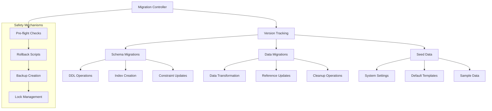

# Migration and Deployment Strategy
## Social Media Content Visual Pipeline Database

### Overview

This document outlines the comprehensive migration and deployment strategy for the Social Media Content Visual Pipeline database, covering initial setup, schema migrations, data migrations, rollback procedures, and production deployment best practices.

### Database Migration Architecture

#### Migration Framework Structure



### Migration Management System

#### Version Control Schema

```sql
-- Migration tracking table
CREATE TABLE schema_migrations (
    id SERIAL PRIMARY KEY,
    version VARCHAR(20) UNIQUE NOT NULL,
    description TEXT NOT NULL,
    migration_type VARCHAR(20) DEFAULT 'schema' CHECK (migration_type IN ('schema', 'data', 'seed')),
    applied_at TIMESTAMP WITH TIME ZONE DEFAULT CURRENT_TIMESTAMP,
    rollback_sql TEXT,
    checksum VARCHAR(64),
    execution_time_ms INTEGER,
    applied_by VARCHAR(100),
    status VARCHAR(20) DEFAULT 'completed' CHECK (status IN ('pending', 'running', 'completed', 'failed', 'rolled_back'))
);

-- Migration locks to prevent concurrent execution
CREATE TABLE migration_locks (
    lock_name VARCHAR(50) PRIMARY KEY,
    locked_at TIMESTAMP WITH TIME ZONE DEFAULT CURRENT_TIMESTAMP,
    locked_by VARCHAR(100),
    process_id INTEGER
);

-- Migration dependencies tracking
CREATE TABLE migration_dependencies (
    id SERIAL PRIMARY KEY,
    migration_version VARCHAR(20) REFERENCES schema_migrations(version),
    depends_on_version VARCHAR(20) REFERENCES schema_migrations(version),
    created_at TIMESTAMP WITH TIME ZONE DEFAULT CURRENT_TIMESTAMP
);
```

#### Migration Script Template

```sql
-- Migration: 001_initial_schema.sql
-- Description: Initial database schema creation
-- Type: schema
-- Dependencies: none

-- === MIGRATION START ===
BEGIN;

-- Create lock to prevent concurrent execution
INSERT INTO migration_locks (lock_name, locked_by, process_id) 
VALUES ('migration_001', user, pg_backend_pid());

-- Pre-flight checks
DO $$
BEGIN
    -- Check PostgreSQL version
    IF current_setting('server_version_num')::int < 140000 THEN
        RAISE EXCEPTION 'PostgreSQL 14 or higher required';
    END IF;
    
    -- Check required extensions
    IF NOT EXISTS (SELECT 1 FROM pg_available_extensions WHERE name = 'uuid-ossp') THEN
        RAISE EXCEPTION 'uuid-ossp extension not available';
    END IF;
END $$;

-- Enable required extensions
CREATE EXTENSION IF NOT EXISTS "uuid-ossp";
CREATE EXTENSION IF NOT EXISTS "pg_trgm";
CREATE EXTENSION IF NOT EXISTS "btree_gin";

-- === SCHEMA CHANGES ===
-- [Include schema creation SQL here]

-- Record migration
INSERT INTO schema_migrations (version, description, migration_type, checksum) 
VALUES ('001', 'Initial database schema creation', 'schema', md5(current_query()));

-- Remove lock
DELETE FROM migration_locks WHERE lock_name = 'migration_001';

COMMIT;

-- === ROLLBACK SCRIPT ===
-- Store rollback instructions
UPDATE schema_migrations 
SET rollback_sql = 'DROP SCHEMA public CASCADE; CREATE SCHEMA public;'
WHERE version = '001';
```

### Deployment Phases

#### Phase 1: Development Environment Setup

1. **Local Development Database**
   ```bash
   #!/bin/bash
   # setup-dev-database.sh
   
   set -e
   
   # Configuration
   DB_NAME="social_media_pipeline_dev"
   DB_USER="pipeline_dev"
   DB_PASS="dev_password"
   POSTGRES_VERSION="14"
   
   # Create database and user
   createdb $DB_NAME
   psql -d $DB_NAME -c "CREATE USER $DB_USER WITH PASSWORD '$DB_PASS';"
   psql -d $DB_NAME -c "GRANT ALL PRIVILEGES ON DATABASE $DB_NAME TO $DB_USER;"
   
   # Run migrations
   python migrate.py --env development --target latest
   
   # Seed development data
   python seed.py --env development --dataset sample
   
   echo "Development database setup complete"
   ```

2. **Migration Runner Implementation**
   ```python
   # migrate.py - Database migration runner
   import sys
   import hashlib
   import logging
   from pathlib import Path
   from typing import List, Dict
   import psycopg2
   from psycopg2.extras import RealDictCursor
   
   class DatabaseMigrator:
       def __init__(self, connection_string: str):
           self.conn = psycopg2.connect(connection_string)
           self.conn.autocommit = False
           
       def get_applied_migrations(self) -> List[str]:
           with self.conn.cursor() as cursor:
               cursor.execute("""
                   SELECT version FROM schema_migrations 
                   WHERE status = 'completed' 
                   ORDER BY applied_at
               """)
               return [row[0] for row in cursor.fetchall()]
       
       def apply_migration(self, migration_file: Path) -> bool:
           try:
               # Read migration file
               sql_content = migration_file.read_text()
               version = self.extract_version(migration_file.name)
               
               # Calculate checksum
               checksum = hashlib.md5(sql_content.encode()).hexdigest()
               
               # Execute migration
               start_time = time.time()
               with self.conn.cursor() as cursor:
                   cursor.execute(sql_content)
               
               execution_time = int((time.time() - start_time) * 1000)
               
               # Update tracking
               with self.conn.cursor() as cursor:
                   cursor.execute("""
                       UPDATE schema_migrations 
                       SET status = 'completed', execution_time_ms = %s
                       WHERE version = %s
                   """, (execution_time, version))
               
               self.conn.commit()
               logging.info(f"Applied migration {version} in {execution_time}ms")
               return True
               
           except Exception as e:
               self.conn.rollback()
               logging.error(f"Migration {version} failed: {e}")
               return False
   
       def rollback_migration(self, version: str) -> bool:
           try:
               with self.conn.cursor() as cursor:
                   # Get rollback SQL
                   cursor.execute("""
                       SELECT rollback_sql FROM schema_migrations 
                       WHERE version = %s AND rollback_sql IS NOT NULL
                   """, (version,))
                   
                   result = cursor.fetchone()
                   if not result:
                       raise Exception(f"No rollback script for version {version}")
                   
                   # Execute rollback
                   cursor.execute(result[0])
                   
                   # Update status
                   cursor.execute("""
                       UPDATE schema_migrations 
                       SET status = 'rolled_back' 
                       WHERE version = %s
                   """, (version,))
               
               self.conn.commit()
               logging.info(f"Rolled back migration {version}")
               return True
               
           except Exception as e:
               self.conn.rollback()
               logging.error(f"Rollback {version} failed: {e}")
               return False
   ```

#### Phase 2: Staging Environment Deployment

1. **Staging Database Setup**
   ```yaml
   # docker-compose.staging.yml
   version: '3.8'
   services:
     postgres-staging:
       image: postgres:14
       environment:
         POSTGRES_DB: social_media_pipeline_staging
         POSTGRES_USER: pipeline_staging
         POSTGRES_PASSWORD: ${STAGING_DB_PASSWORD}
       volumes:
         - postgres_staging_data:/var/lib/postgresql/data
         - ./database_schema.sql:/docker-entrypoint-initdb.d/01-schema.sql
         - ./seed_data.sql:/docker-entrypoint-initdb.d/02-seed.sql
       ports:
         - "5433:5432"
       command: >
         postgres
         -c shared_buffers=256MB
         -c effective_cache_size=1GB
         -c maintenance_work_mem=64MB
         -c checkpoint_completion_target=0.9
         -c wal_level=replica
         -c max_wal_size=1GB
         -c min_wal_size=256MB
         -c log_statement=all
         -c log_duration=on
   
   volumes:
     postgres_staging_data:
   ```

2. **Staging Deployment Script**
   ```bash
   #!/bin/bash
   # deploy-staging.sh
   
   set -e
   
   ENV="staging"
   BACKUP_DIR="/backups/staging"
   TIMESTAMP=$(date +"%Y%m%d_%H%M%S")
   
   echo "Starting staging deployment..."
   
   # Create backup before deployment
   mkdir -p $BACKUP_DIR
   pg_dump $STAGING_DB_URL > "$BACKUP_DIR/pre_deploy_$TIMESTAMP.sql"
   
   # Run migrations
   python migrate.py --env $ENV --target latest --dry-run
   
   read -p "Proceed with migrations? (y/N): " -n 1 -r
   if [[ $REPLY =~ ^[Yy]$ ]]; then
       python migrate.py --env $ENV --target latest
   else
       echo "Deployment cancelled"
       exit 1
   fi
   
   # Run smoke tests
   python test_db_connectivity.py --env $ENV
   python validate_schema.py --env $ENV
   
   echo "Staging deployment complete"
   ```

#### Phase 3: Production Deployment

1. **Production-Ready Configuration**
   ```sql
   -- production-optimizations.sql
   -- Performance optimizations for production
   
   -- Memory settings
   ALTER SYSTEM SET shared_buffers = '512MB';
   ALTER SYSTEM SET effective_cache_size = '2GB';
   ALTER SYSTEM SET work_mem = '16MB';
   ALTER SYSTEM SET maintenance_work_mem = '256MB';
   
   -- Connection settings
   ALTER SYSTEM SET max_connections = 200;
   ALTER SYSTEM SET superuser_reserved_connections = 3;
   
   -- WAL settings
   ALTER SYSTEM SET wal_level = 'replica';
   ALTER SYSTEM SET max_wal_size = '2GB';
   ALTER SYSTEM SET min_wal_size = '512MB';
   ALTER SYSTEM SET checkpoint_completion_target = 0.9;
   ALTER SYSTEM SET checkpoint_timeout = '10min';
   
   -- Logging settings
   ALTER SYSTEM SET log_destination = 'csvlog';
   ALTER SYSTEM SET logging_collector = on;
   ALTER SYSTEM SET log_directory = 'pg_log';
   ALTER SYSTEM SET log_filename = 'postgresql-%Y-%m-%d_%H%M%S.log';
   ALTER SYSTEM SET log_rotation_age = '1d';
   ALTER SYSTEM SET log_min_duration_statement = 1000; -- Log slow queries
   ALTER SYSTEM SET log_checkpoints = on;
   ALTER SYSTEM SET log_connections = on;
   ALTER SYSTEM SET log_disconnections = on;
   
   -- Reload configuration
   SELECT pg_reload_conf();
   ```

2. **Blue-Green Deployment Strategy**
   ```bash
   #!/bin/bash
   # blue-green-deploy.sh
   
   set -e
   
   # Configuration
   BLUE_DB="social_media_pipeline_prod"
   GREEN_DB="social_media_pipeline_prod_new"
   BACKUP_DIR="/backups/production"
   TIMESTAMP=$(date +"%Y%m%d_%H%M%S")
   
   echo "Starting blue-green deployment..."
   
   # Step 1: Create green environment
   echo "Creating green database..."
   createdb $GREEN_DB
   
   # Step 2: Replicate current data
   echo "Replicating data to green environment..."
   pg_dump $BLUE_DB | psql $GREEN_DB
   
   # Step 3: Apply migrations to green
   echo "Applying migrations to green environment..."
   python migrate.py --db $GREEN_DB --target latest
   
   # Step 4: Run validation tests
   echo "Running validation tests..."
   python validate_migration.py --db $GREEN_DB
   
   # Step 5: Switch traffic (application-level routing)
   echo "Ready to switch traffic."
   read -p "Switch to green database? (y/N): " -n 1 -r
   
   if [[ $REPLY =~ ^[Yy]$ ]]; then
       # Update application configuration
       kubectl set env deployment/api-server DATABASE_URL=$GREEN_DB_URL
       
       # Wait for rollout
       kubectl rollout status deployment/api-server
       
       # Backup old database
       pg_dump $BLUE_DB > "$BACKUP_DIR/blue_backup_$TIMESTAMP.sql"
       
       # Rename databases
       psql -c "ALTER DATABASE $BLUE_DB RENAME TO ${BLUE_DB}_old_$TIMESTAMP;"
       psql -c "ALTER DATABASE $GREEN_DB RENAME TO $BLUE_DB;"
       
       echo "Deployment complete. Old database backed up as ${BLUE_DB}_old_$TIMESTAMP"
   else
       echo "Deployment cancelled. Cleaning up green environment..."
       dropdb $GREEN_DB
   fi
   ```

### Data Migration Strategies

#### Large Dataset Migration

1. **Chunked Data Processing**
   ```sql
   -- Migration: 005_migrate_legacy_assets.sql
   -- Migrate large datasets in chunks to avoid locks
   
   CREATE OR REPLACE FUNCTION migrate_legacy_assets_batch(
       batch_size INTEGER DEFAULT 1000,
       start_id BIGINT DEFAULT 0
   ) RETURNS INTEGER AS $$
   DECLARE
       processed_count INTEGER := 0;
       batch_count INTEGER;
   BEGIN
       LOOP
           -- Process batch
           WITH batch_data AS (
               SELECT id, legacy_data
               FROM legacy_assets
               WHERE id > start_id
               ORDER BY id
               LIMIT batch_size
           ),
           migrated_batch AS (
               INSERT INTO generated_assets (
                   id, asset_name, asset_type, file_path,
                   created_at, metadata
               )
               SELECT 
                   gen_random_uuid(),
                   (legacy_data->>'name'),
                   CASE (legacy_data->>'type')
                       WHEN 'img' THEN 'image'
                       ELSE 'graphic'
                   END,
                   (legacy_data->>'path'),
                   (legacy_data->>'created')::timestamp,
                   legacy_data - 'name' - 'type' - 'path' - 'created'
               FROM batch_data
               RETURNING 1
           )
           SELECT count(*) INTO batch_count FROM migrated_batch;
           
           processed_count := processed_count + batch_count;
           
           -- Update start_id for next batch
           SELECT COALESCE(MAX(id), start_id) INTO start_id
           FROM legacy_assets
           WHERE id > start_id
           LIMIT batch_size;
           
           -- Exit if no more records
           EXIT WHEN batch_count = 0;
           
           -- Log progress
           RAISE NOTICE 'Processed % records, last ID: %', processed_count, start_id;
           
           -- Small delay to reduce load
           PERFORM pg_sleep(0.1);
       END LOOP;
       
       RETURN processed_count;
   END;
   $$ LANGUAGE plpgsql;
   
   -- Execute migration in chunks
   SELECT migrate_legacy_assets_batch(500);
   ```

2. **Parallel Data Migration**
   ```python
   # parallel_migration.py
   import asyncio
   import asyncpg
   from concurrent.futures import ThreadPoolExecutor
   
   class ParallelMigrator:
       def __init__(self, connection_string: str, max_workers: int = 4):
           self.connection_string = connection_string
           self.max_workers = max_workers
       
       async def migrate_table_parallel(self, table_name: str, batch_size: int = 1000):
           # Get total record count
           async with asyncpg.connect(self.connection_string) as conn:
               total_count = await conn.fetchval(
                   f"SELECT COUNT(*) FROM {table_name}"
               )
           
           # Calculate batches
           batch_ranges = []
           for i in range(0, total_count, batch_size):
               batch_ranges.append((i, min(i + batch_size, total_count)))
           
           # Process batches in parallel
           with ThreadPoolExecutor(max_workers=self.max_workers) as executor:
               tasks = [
                   executor.submit(self.process_batch, table_name, start, end)
                   for start, end in batch_ranges
               ]
               
               for task in asyncio.as_completed(tasks):
                   result = await task
                   logging.info(f"Completed batch: {result}")
   
       async def process_batch(self, table_name: str, offset: int, limit: int):
           async with asyncpg.connect(self.connection_string) as conn:
               # Process specific range of records
               records = await conn.fetch(f"""
                   SELECT * FROM {table_name}
                   ORDER BY id
                   OFFSET {offset}
                   LIMIT {limit}
               """)
               
               # Transform and insert
               for record in records:
                   transformed = self.transform_record(record)
                   await self.insert_transformed_record(conn, transformed)
               
               return f"Processed {len(records)} records"
   ```

### Rollback Procedures

#### Automated Rollback System

1. **Rollback Trigger Implementation**
   ```sql
   -- Rollback trigger for failed deployments
   CREATE OR REPLACE FUNCTION check_migration_health()
   RETURNS TRIGGER AS $$
   DECLARE
       error_count INTEGER;
       recent_failures INTEGER;
   BEGIN
       -- Check for recent migration failures
       SELECT COUNT(*) INTO recent_failures
       FROM schema_migrations
       WHERE status = 'failed'
         AND applied_at > CURRENT_TIMESTAMP - INTERVAL '1 hour';
       
       -- Auto-rollback if too many failures
       IF recent_failures >= 3 THEN
           RAISE EXCEPTION 'Too many migration failures, triggering rollback';
       END IF;
       
       RETURN NEW;
   END;
   $$ LANGUAGE plpgsql;
   
   CREATE TRIGGER migration_health_check
       AFTER INSERT OR UPDATE ON schema_migrations
       FOR EACH ROW
       EXECUTE FUNCTION check_migration_health();
   ```

2. **Point-in-Time Recovery Setup**
   ```bash
   #!/bin/bash
   # setup-pitr.sh - Configure Point-in-Time Recovery
   
   # WAL archiving configuration
   cat >> /var/lib/postgresql/data/postgresql.conf << EOF
   # WAL archiving
   archive_mode = on
   archive_command = 'cp %p /backup/wal_archive/%f'
   archive_timeout = 60
   
   # Continuous archiving
   wal_level = replica
   max_wal_senders = 3
   max_replication_slots = 3
   EOF
   
   # Create WAL archive directory
   mkdir -p /backup/wal_archive
   chown postgres:postgres /backup/wal_archive
   
   # Setup base backup cron job
   echo "0 2 * * * postgres pg_basebackup -D /backup/base/\$(date +\%Y\%m\%d) -Ft -z -P" >> /etc/crontab
   ```

### Monitoring and Validation

#### Migration Health Monitoring

```sql
-- Migration monitoring views
CREATE VIEW v_migration_status AS
SELECT 
    version,
    description,
    migration_type,
    status,
    applied_at,
    execution_time_ms,
    CASE 
        WHEN status = 'failed' THEN 'CRITICAL'
        WHEN execution_time_ms > 10000 THEN 'WARNING'
        ELSE 'OK'
    END as health_status
FROM schema_migrations
ORDER BY applied_at DESC;

-- Performance impact monitoring
CREATE VIEW v_migration_performance AS
SELECT 
    DATE_TRUNC('hour', applied_at) as hour,
    COUNT(*) as migration_count,
    AVG(execution_time_ms) as avg_execution_time,
    MAX(execution_time_ms) as max_execution_time,
    COUNT(CASE WHEN status = 'failed' THEN 1 END) as failure_count
FROM schema_migrations
WHERE applied_at > CURRENT_TIMESTAMP - INTERVAL '24 hours'
GROUP BY DATE_TRUNC('hour', applied_at)
ORDER BY hour DESC;
```

#### Post-Migration Validation

```python
# validation.py - Post-migration validation suite
class MigrationValidator:
    def __init__(self, db_connection):
        self.db = db_connection
    
    def validate_schema_integrity(self) -> bool:
        """Validate all foreign key relationships"""
        validation_queries = [
            "SELECT COUNT(*) FROM users WHERE id NOT IN (SELECT DISTINCT created_by FROM organizations WHERE created_by IS NOT NULL)",
            "SELECT COUNT(*) FROM content_requests WHERE brand_profile_id NOT IN (SELECT id FROM brand_profiles)",
            "SELECT COUNT(*) FROM generated_assets WHERE content_request_id NOT IN (SELECT id FROM content_requests)"
        ]
        
        for query in validation_queries:
            result = self.db.fetchone(query)[0]
            if result > 0:
                raise ValidationError(f"Foreign key integrity violation: {query}")
        
        return True
    
    def validate_data_consistency(self) -> bool:
        """Validate business logic constraints"""
        checks = [
            ("Brand compliance scores", "SELECT COUNT(*) FROM generated_assets WHERE compliance_score NOT BETWEEN 0 AND 1"),
            ("API costs", "SELECT COUNT(*) FROM api_usage WHERE cost_per_request < 0"),
            ("User activity", "SELECT COUNT(*) FROM user_activity_logs WHERE created_at > CURRENT_TIMESTAMP")
        ]
        
        for description, query in checks:
            result = self.db.fetchone(query)[0]
            if result > 0:
                raise ValidationError(f"{description} validation failed: {result} violations")
        
        return True
    
    def performance_baseline_check(self) -> bool:
        """Ensure key queries perform within acceptable limits"""
        performance_tests = [
            ("Dashboard query", "SELECT COUNT(*) FROM v_active_content_requests", 100),  # 100ms max
            ("Analytics query", "SELECT COUNT(*) FROM v_daily_api_usage", 500),  # 500ms max
        ]
        
        for test_name, query, max_time_ms in performance_tests:
            start_time = time.time()
            self.db.execute(query)
            execution_time = (time.time() - start_time) * 1000
            
            if execution_time > max_time_ms:
                raise ValidationError(f"{test_name} took {execution_time}ms (max: {max_time_ms}ms)")
        
        return True
```

This comprehensive migration and deployment strategy ensures safe, reliable database deployments with proper rollback mechanisms, monitoring, and validation procedures to maintain system integrity throughout the deployment lifecycle.